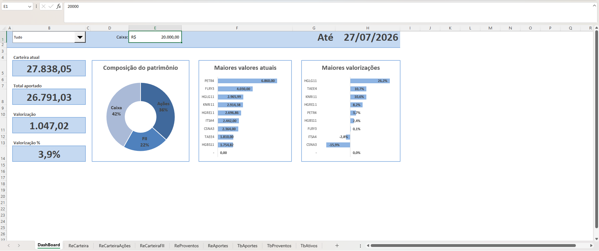
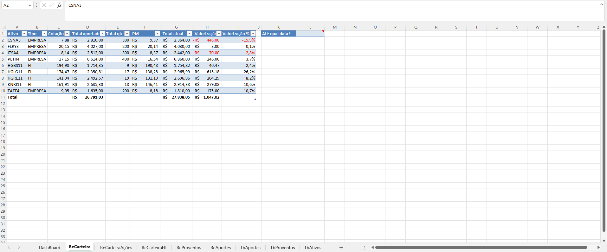
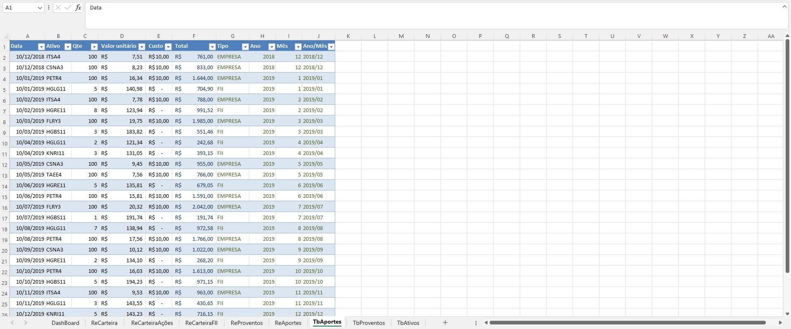

# 📊 Sistema de Gestão de Ativos Financeiros & Dashboard (Excel)


Projeto prático desenvolvido durante o **Curso Excel COMPLETO (do básico ao avançado)** ministrado pelos professores Prof. Dr. Nelio Alves e Prof. Me. Bruno Arantes (*EducandoWeb*).

O sistema consiste em uma solução completa para cadastro, monitoramento, apuração e análise de performance de investimentos em **Ações** e **Fundos Imobiliários (FIIs)**, integrando cotações em tempo real via Web e um Dashboard interativo.

---

## 📸 Visão Geral do Dashboard

> *Adicione aqui a captura de tela principal do seu Dashboard completo.*



---

## 🛠️ Funcionalidades do Sistema

### 1. Módulo de Cadastros (Tabelas de Entrada)
* **Ativos (`TbAtivos`):** Integração via Google Sheets (`GOOGLEFINANCE`) importada para o Excel via Power Query / Web Data para atualização dinâmica de cotações.
* **Aportes (`TbAportes`):** Registro de compras com cálculo automático de custos, divisão por tipo de ativo (Ações / FIIs) e categorização temporal (Ano/Mês).
* **Vendas & Proventos (`TbProventos`):** Controle detalhado de dividendos, JCP e rendimentos recebidos, incluindo apuração de Imposto de Renda (IR).

### 2. Relatórios de Análise (Tabelas Dinâmicas / Consolidados)
* **Posição Acionária e Carteira (`ReCarteira`):**
  * Apuração do **Preço Médio (PM)** de cada ativo.
  * Cálculo de valorização/desvalorização nominal (R$) e percentual (%).
  * Simulação histórica/trava de datas ("Carteira até a data X").
  * Formatação condicional para destaque de rentabilidade.
* **Aportes Mês a Mês (`ReAportes`):** Visão temporal do capital investido por classe de ativo.
* **Proventos Mês a Mês (`ReProventos`):** Histórico de renda passiva gerada pela carteira ao longo do tempo.

### 3. Dashboard Interativo
* **Indicadores Chave (KPIs):** Patrimônio total, total aportado, caixa disponível e valorização geral.
* **Filtros Dinâmicos:** Controle por Caixa de Combinação (Todas as posições / Ações / FIIs).
* **Gráfico de Rosca:** Distribuição percentual do patrimônio.
* **Gráficos de Barras Ordenados:** Top ativos por maior valor investido e Top maiores valorizações na carteira.

---

## 🖼️ Telas do Projeto

### Relatório de Carteira & Posição
> *Cole aqui um print da aba ReCarteira.*



### Cadastro de Aportes e Proventos
> *Cole aqui um print das abas TbAportes ou TbProventos.*



---

## 📐 Fórmulas e Lógicas Destacadas

Para a construção dos rankings dinâmicos do Dashboard sem distorcer os dados, foram aplicadas combinações avançadas de funções do Excel:

* **Tratamento e busca de dados dinâmicos:**
  ```excel
  =SE(É.NÃO.DISP(ÍNDICE(TbCarteira[Ativo]; U4; 1)); "-"; ÍNDICE(TbCarteira[Ativo]; U4; 1))